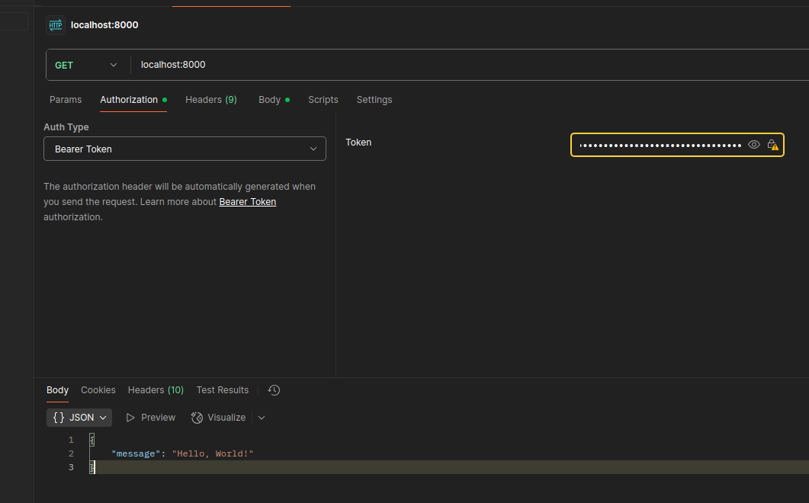

# Simple JWT Auth

A Django project demonstrating JWT authentication using `djangorestframework-simplejwt`. 

## Features

- JWT token authentication endpoints
- Django admin interface
- Modular app structure

## Setup

1. **Clone the repository:**
   ```bash
   git clone <your-repo-url>
   cd simple_jwt_auth
   ```

2. **Create and activate a virtual environment:**
   ```bash
   conda create -n auth_venv python=3.10
   conda activate auth_venv
   ```

3. **Install dependencies:**
   ```bash
   pip install -r requirements.txt
   ```

4. **Apply migrations:**
   ```bash
   python manage.py migrate
   ```

5. **Run the development server:**
   ```bash
   python manage.py createsuperuser
   python manage.py runserver
   ```

## API Endpoints

- `POST /api/token/` — Obtain JWT token pair (access & refresh)
- `POST /api/token/refresh/` — Refresh access token

## Usage

- Use the `/api/token/` endpoint to get your JWT tokens by providing valid user credentials.
- Use the `/api/token/refresh/` endpoint to refresh your access token.

Then, use this access token to make requests to authenticated endpoints like( http://127.0.0.1:8000/ )Select auth type and change to Bearer Token. 



